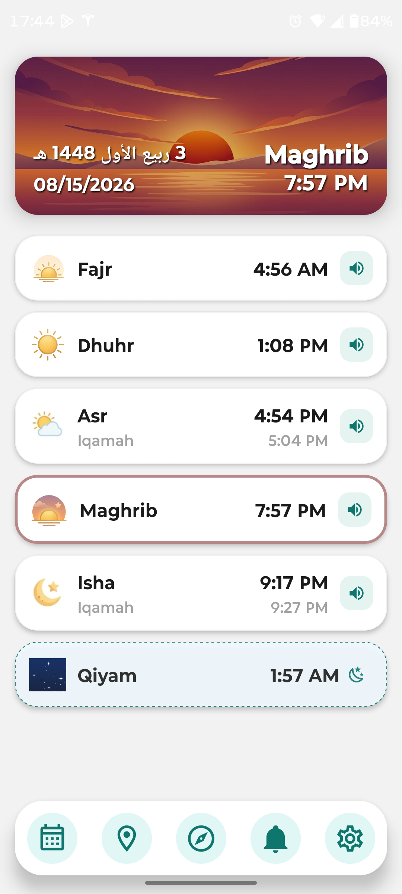
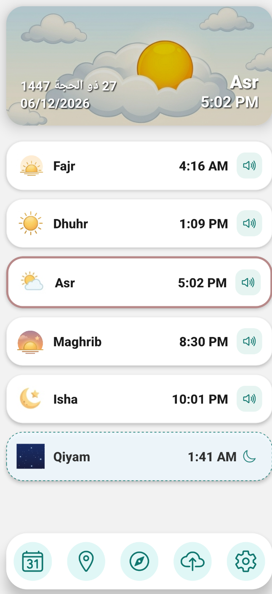
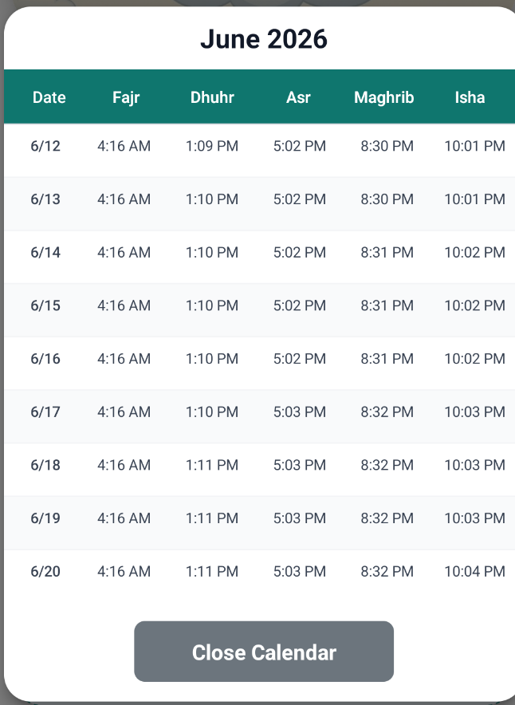
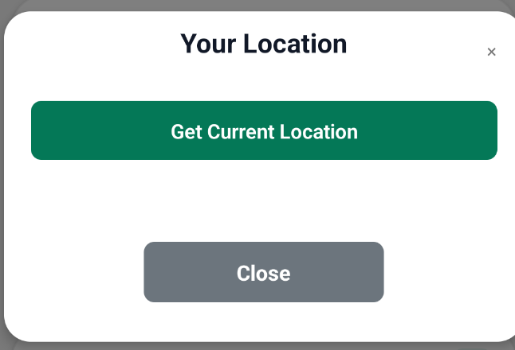
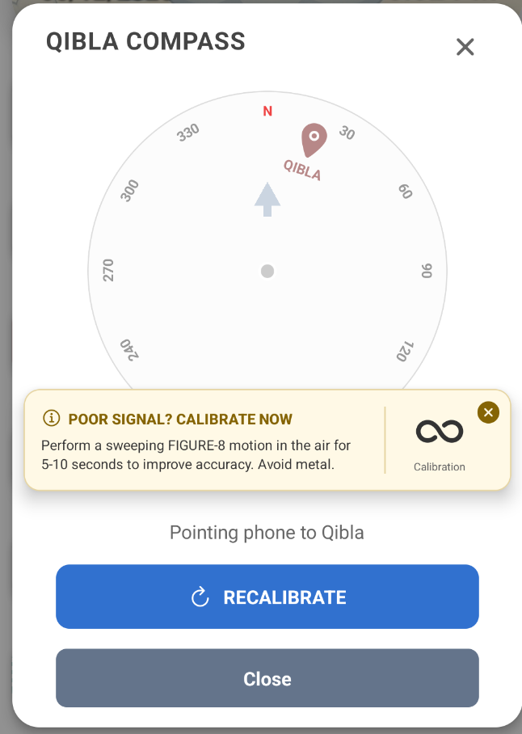
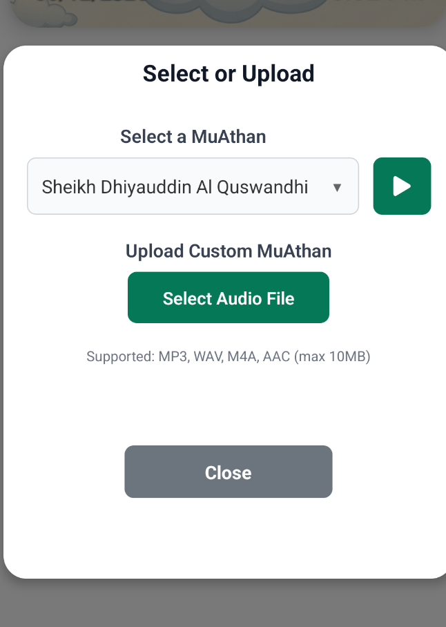
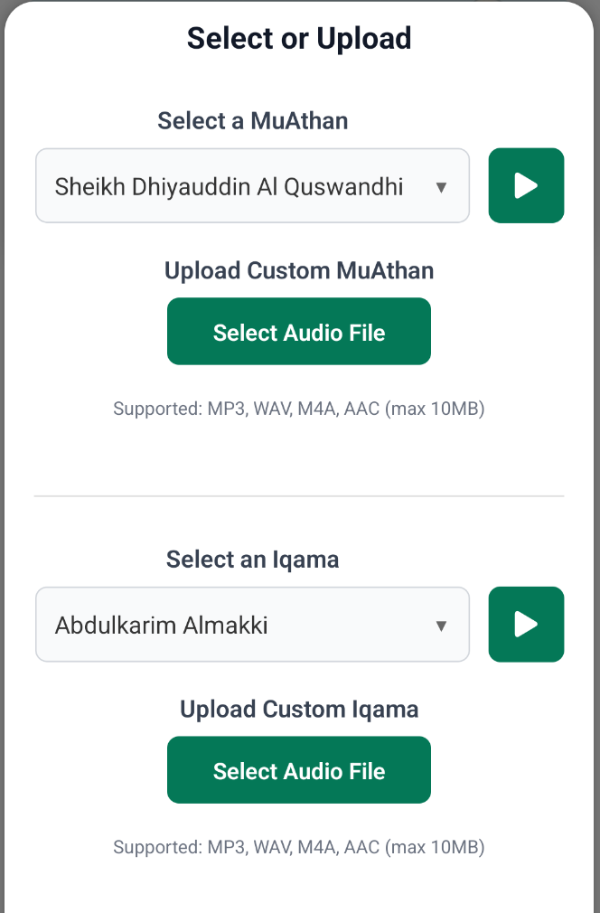
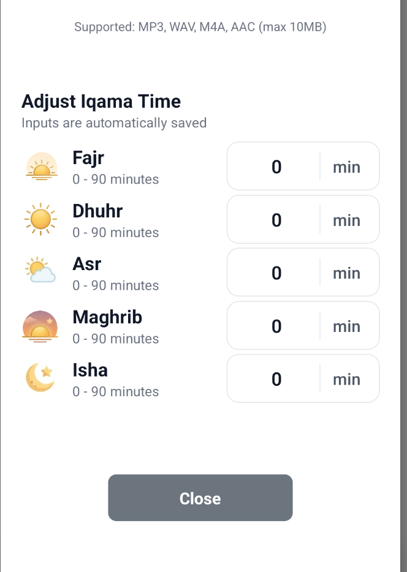
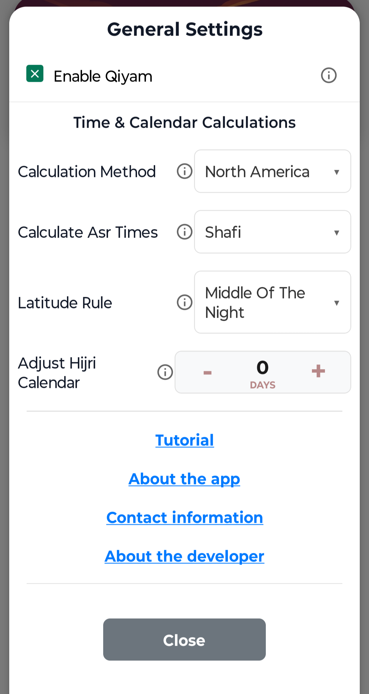

# WahidLink Salah Tutorial 

Welcome to WahidLink—your all-in-one digital companion for your daily Islamic lifestyle. Below is the primary dashboard for WahidLink’s Salah (Prayer) Times.

## Key Features & Customization
The dashboard is equipped with several customizable features designed to fit your daily routine. Explore the guides below to tailor the app to your preferences:

### Time Ago & Time Until
Tapping on any individual Salah (Prayer) Time provides a dynamic countdown. If the prayer time has already passed, it will show how much time has elapsed. 

If the prayer is upcoming, it will display the exact time remaining until that Salah begins.

### Adjust Salah Times
Long-press (press and hold for 3 seconds) on any individual Salah time to open the manual adjustment menu. This allows you to fine-tune the specific prayer time by up to +/- 45 minutes to perfectly match your local masjid. 

</img>

### Unlocking Qiyam
Enabling the Enable Qiyam toggle within General Settings dynamically updates your main dashboard, adding a dedicated tracker for Qiyam immediately following the Isha prayer.

### Monthly Calendar
The Calendar is the first icon on the bottom left of the menu. Tap it to view the prayer times for the next 30 days

### Location (Basic)
The Location icon is the second button on the bottom menu, right next to the calendar. Tap it to open the location setup menu and update your coordinates.

### Qibla Compass
The Qibla icon is the third button on the bottom menu, right next to the location icon. Tap it to open the Qibla compass and instantly find the direction of the Kaaba.

### Athan/Iqama Selection
The Athan/Iqamah icon is the fourth button on the bottom menu, located right next to the Qibla icon.

<b>Default View:</b> Out of the box, this screen allows you to select and upload your preferred Athan recitations.

<b>Unlocking Iqamah Settings:</b> If you toggle Enable Iqamah in the General Settings, this screen expands to include both Iqamah audio selection and the Adjust Iqamah Times configuration.

### General Settings
The General Settings icon is located on the far right of the bottom menu. Here, you can fully customize how your prayer times are calculated and how the app behaves:

    
